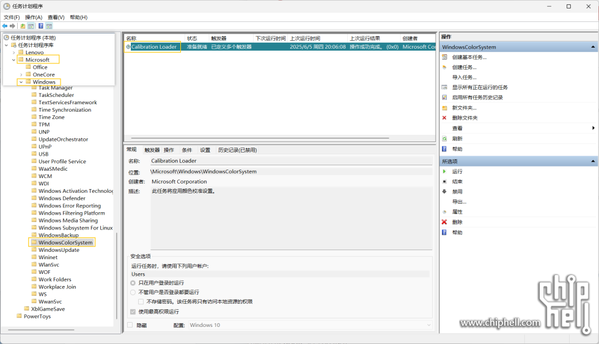
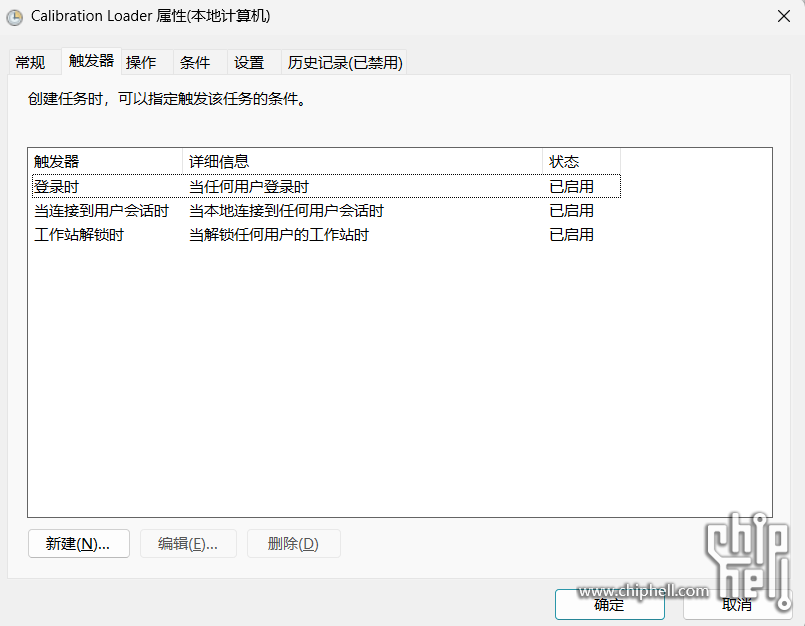
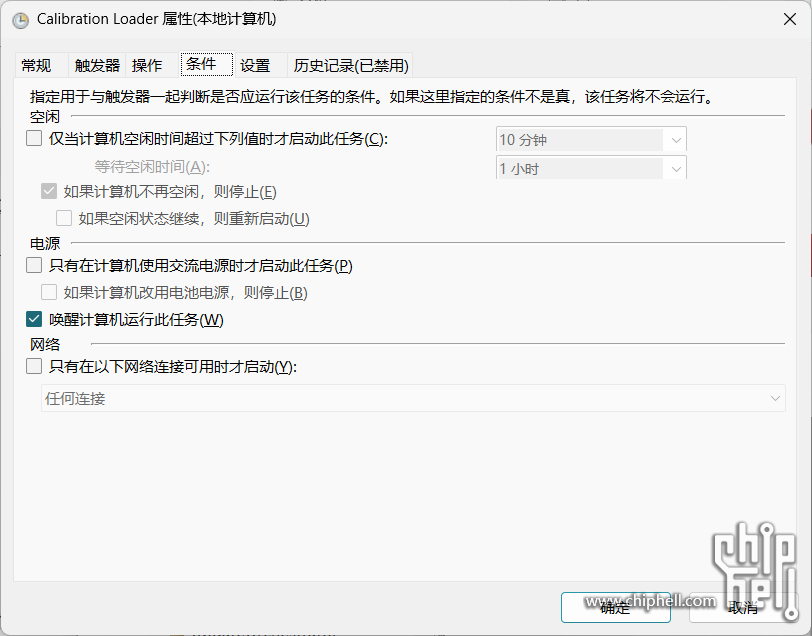

#### 按键重复延迟
win + R 输入 control keyboard，切换到 速度 选项卡，把重复延迟拉到最短，重复速度拉到最快。

#### 关闭系统提示音
win + R 输入 mmsys.cpl，切换到 声音 选项卡，点击 声音方案 下拉菜单，选择 无。

### Clash Verge (github)

### [CapsLock 映射 单击 Esc, 组合键 Ctrl](https://zhuanlan.zhihu.com/p/595742183)
#### [capsicain.exe](https://github.com/cajhin/capsicain)

开机静默自启：
1. 创建快捷方式
2. 复制到 `C:\Users\ele 001\AppData\Roaming\Microsoft\Windows\Start Menu\Programs\Startup` 文件夹（或者用 Win + R 输入 `shell:startup` 打开）
3. Alt + Enter 查看属性，修改 `运行方式(R):` 为`最小化`
4. (Optional) 加速 Startup 的程序的启动速度：创建并运行脚本 [regedit_startup.reg](./scripts/regedit_startup.reg)（修改注册表）（参考 [github issue](https://github.com/ZyperWave/ZyperWinOptimize/issues/24)）

> Clash Verge uses the same way to set automatically startup. You can fine `Clash Verge` quick start in the same directory.

### [kanata](https://github.com/jtroo/kanata)
kanata_gui.exe
- cross-platform
- 自带开机自启 + 静默

> Problem: 开启 kanata 时，一旦打开一些windows系统的弹窗，例如下载，安装，或powertoys时，整个键盘就会失灵
>
> Solution: 使用 capsicain.exe

### Cursor

### Git

### Nvim
1. Download Neovim and set PATH
2. Download `VSCode Neovim` extension
3. Cursor > Settings >
    - Neovim Executable Paths: Win32 `D:\nvim\bin\nvim.exe`
    - Neovim Init Vim Paths: Win32 `D:\nvim\init.lua` (Use [init.lua](./scripts/init.lua))

### Microsoft Store
Microsoft Store 初始化失败

方法一（临时）：Win + I > 使用代理服务器 > 关闭

方法二：Clash Verge
1. 设置 > Clash 设置 > UWP 工具
2. DisplayName > Microsoft Store > 勾选 > Save Changes

### 显示屏色差

方法一：Nvida Control Panel

调整桌面颜色设置 > 颜色通道
- 红色：亮度 50%（默认）
- 蓝色：亮度 42%
- 绿色：亮度 25%

方法二：X-Rite Color Assistant (Legion)

预览 > 选择配置文件 > sRGB

#### [电脑从睡眠状态唤醒，屏幕的颜色配置文件都不生效](https://www.chiphell.com/thread-2666862-1-1.html)

Y7000 Windows11 25H2

联想 Y7000P，系统 Windows 11 24H2 26100.3775，也遇到了这个问题。

我用这个方法解决了：

1. Win + R > taskschd.msc > 任务计划程序库 - Microsoft - Windows - WindowsColorSystem

